# Arquitetura de Referência: AWS ECS com Deploy Híbridro.


## Objetivo do Projeto

Este projeto foi criado como um caso de estudo prático para demonstrar a implementação de uma arquitetura de nuvem moderna, robusta e escalável na AWS. O objetivo é explorar e comparar duas abordagens de computação para containers com o Amazon ECS (EC2 e Fargate), utilizando as melhores práticas de Infraestrutura como Código (IaC) com Terraform.

## Funcionalidades Principais

- **Infraestrutura como Código (IaC)**: Toda a infraestrutura é provisionada e gerenciada com Terraform, permitindo automação, versionamento e reprodutibilidade.
- **Arquitetura em Camadas**: O código Terraform é modularizado em camadas (Foundation, Network, App) para promover isolamento, reutilização e clareza.
- **Deploy Híbrido**: Suporte para deploy da aplicação em containers de duas formas:
    - **ECS com EC2**: Controle granular sobre as instâncias que rodam os containers.
    - **ECS com Fargate**: Abordagem *serverless* para máxima simplicidade operacional.
- **Rede Segura e Isolada**: Criação de uma VPC customizada com sub-redes públicas e privadas para garantir que os componentes da aplicação estejam devidamente isolados.
- **Alta Disponibilidade**: Uso de Auto Scaling Group para as instâncias EC2 e múltiplos containers distribuídos para garantir que a aplicação seja resiliente a falhas.
- **Entrega Contínua Simplificada**: Scripts para automatizar o build da imagem Docker, push para o ECR (Elastic Container Registry) e atualização do serviço no ECS.
- **Gerenciamento de DNS**: Integração com a Cloudflare para gerenciar registros de DNS e apontar um domínio amigável para a aplicação.
- **Estimativa de Custos**: Integração com a ferramenta `infracost` para análise e previsão de custos antes do deploy.

## Desenho da Arquitetura


*Para uma explicação detalhada dos componentes e fluxos, veja a [Legenda do Diagrama](./assets/LEGEND.md).*

## Tecnologias Utilizadas

- **Cloud Provider**: AWS
- **Infraestrutura como Código**: Terraform
- **Containerização**: Docker
- **Orquestração de Containers**: Amazon ECS (EC2 & Fargate)
- **Registro de Imagens**: Amazon ECR
- **Linguagem da Aplicação**: Python (Flask)
- **DNS & CDN**: Cloudflare
- **CI/CD**: Scripts em Shell (Bash)
- **Análise de Custos**: Infracost

## Estrutura do Projeto

A infraestrutura é dividida em camadas lógicas, cada uma em seu próprio diretório Terraform. Para mais detalhes sobre cada camada, consulte a documentação específica:

- **`00-foundation`**: Cria a base para o armazenamento do estado remoto do Terraform (backend S3 e tabela DynamoDB para lock). ([Ver Documentação](./terraform/00-foundation/README.md))
- **`01-network`**: Provisiona toda a rede, incluindo a VPC, sub-redes públicas e privadas, Internet Gateway, NAT Gateway e Security Groups. ([Ver Documentação](./terraform/01-network/README.md))
- **`02-app-ecs-ec2`**: Implanta a aplicação no ECS usando o modelo EC2. ([Ver Documentação](./terraform/02-app-ecs-ec2/README.md))
- **`03-app-ecs-fargate`**: Implanta a aplicação no ECS usando o modelo Fargate. ([Ver Documentação](./terraform/03-app-ecs-fargate/README.md))
- **`04-dns-cloudflare`**: Gerencia os registros DNS para a aplicação via Cloudflare. ([Ver Documentação](./terraform/04-dns-cloudflare/README.md))

## Pré-requisitos

### Contas de Serviço

1.  **Conta na AWS**: Com permissões para criar os recursos definidos no Terraform (VPC, ECS, ECR, S3, etc.).
2.  **Conta na Cloudflare**: Com um domínio já configurado (necessário para a camada de DNS).

### Ferramentas Locais

1.  **AWS CLI v2**: [Guia de Instalação](https://docs.aws.amazon.com/cli/latest/userguide/getting-started-install.html)
2.  **Terraform**: [Guia de Instalação](https://learn.hashicorp.com/tutorials/terraform/install-cli)
3.  **Docker**: [Guia de Instalação](https://docs.docker.com/engine/install/)

### Configuração de Credenciais

- **AWS**: Configure suas credenciais (via SSO ou IAM User) no AWS CLI. [Guia Oficial](https://docs.aws.amazon.com/cli/latest/userguide/cli-chap-configure.html).
- **Cloudflare**: Se for usar a camada de DNS, você precisará de um API Token e o Zone ID do seu domínio.

### Configuração Central: `scripts/config.sh`

Antes de executar, **é obrigatório** criar e configurar o arquivo `scripts/config.sh`.

1.  **Copie o arquivo de exemplo:**
    ```bash
    cp scripts/config.sh.example scripts/config.sh
    ```
2.  **Edite o `scripts/config.sh`** e preencha as variáveis com seus dados (perfil AWS, chaves da Cloudflare, etc.). O arquivo é ignorado pelo Git para sua segurança.

## Guia de Uso (Passo a Passo)

### 1. Deploy da Infraestrutura

Execute os scripts sequencialmente para provisionar a infraestrutura.

```bash
# 1. Cria o backend S3 e a tabela DynamoDB
./scripts/deploy-00-foundation.sh

# 2. Cria a VPC e todos os recursos de rede
./scripts/deploy-01-network.sh

# 3. Deploy da aplicação (escolha uma ou ambas as opções)
# Opção A: Deploy no ambiente EC2
./scripts/deploy-02-app-ecs-ec2.sh

# Opção B: Deploy no ambiente Fargate
./scripts/deploy-03-app-ecs-fargate.sh
```

### 2. Build e Push da Imagem Docker

Com a infraestrutura da aplicação criada, o ECR estará pronto. Este script constrói e envia a imagem Docker para o repositório correto.

O script requer um argumento: `ec2` ou `fargate`.

```bash
# Para o ambiente EC2
./scripts/build-and-push.sh ec2

# Para o ambiente Fargate
./scripts/build-and-push.sh fargate
```

### 3. (Opcional) Deploy do DNS com Cloudflare

Cria subdomínios amigáveis para acessar a aplicação.

```bash
./scripts/deploy-04-dns-cloudflare.sh
```
Após a execução, a aplicação estará disponível em `https://ec2.seudominio.com` e/ou `https://fargate.seudominio.com`.

### 4. Atualizando a Aplicação (Redeploy)

Para fazer o deploy de uma nova versão da sua aplicação sem recriar a infraestrutura, basta executar o build novamente e forçar um novo deploy no ECS.

```bash
# 1. Faça o build e push da nova imagem
./scripts/build-and-push.sh fargate

# 2. Force o novo deploy no serviço ECS
./scripts/deploy-03-app-ecs-fargate.sh
```
*(Nota: Um script `redeploy.sh` para automatizar isso seria uma ótima melhoria futura!)*

## Destruição do Ambiente

Para evitar custos, **destrua toda a infraestrutura** quando não estiver mais em uso. Execute os scripts com o argumento `destroy` na **ordem inversa** da criação.

```bash
./scripts/deploy-04-dns-cloudflare.sh destroy
./scripts/deploy-03-app-ecs-fargate.sh destroy
./scripts/deploy-02-app-ecs-ec2.sh destroy
./scripts/deploy-01-network.sh destroy
./scripts/deploy-00-foundation.sh destroy
```

## Custos

Para entender e estimar os custos da infraestrutura provisionada, consulte a documentação detalhada em [COST.md](COST.md). O documento inclui instruções sobre como usar a ferramenta **Infracost**.

## Licença

Este projeto está sob a licença MIT. Veja o arquivo [LICENSE](LICENSE) para mais detalhes.

## Contato

Michel Dellabeneta - [LinkedIn](https://www.linkedin.com/in/michel-dellabeneta/) - michel.dellabeneta@gmail.com
