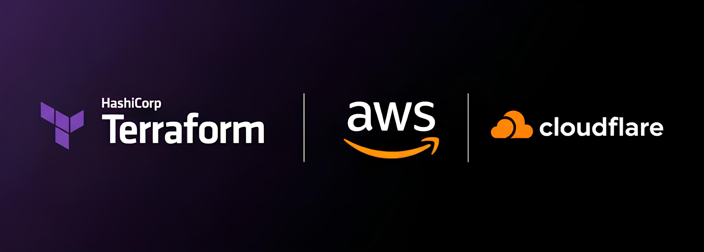

# Arquitetura para AWS ECS: Deploy Híbrido (EC2 & Fargate) + Cloudflare com Terraform. 



## Descrição

Este projeto demonstra como fazer o deploy de uma aplicação web containerizada na Amazon Web Services (AWS) usando o Elastic Container Service (ECS). A infraestrutura como código é gerenciada pelo Terraform, seguindo uma arquitetura de camadas para melhor organização e reutilização.

A aplicação pode ser implantada em duas modalidades distintas:

1.  **ECS com Launch Type EC2**: Onde os containers rodam em um cluster de instâncias EC2 gerenciadas por um Auto Scaling Group.
2.  **ECS com Launch Type Fargate**: Uma abordagem *serverless* onde a AWS gerencia a infraestrutura subjacente, e pagamos pelos recursos alocados aos containers.

### O Dockerfile

O `Dockerfile` na raiz do projeto é responsável por empacotar a aplicação Flask em uma imagem de container. Ele segue os seguintes passos:

- Utiliza uma imagem base leve do Python (`python:3.9-slim`).
- Define o diretório de trabalho como `/app`.
- Copia e instala as dependências listadas em `app/requirements.txt`.
- Copia o código-fonte da aplicação para dentro do container.
- Expõe a porta `8080`, que é a porta que a aplicação escuta.
- O comando final (`CMD`) inicia a aplicação executando `python main.py`.

## Arquitetura

A infraestrutura é dividida em camadas lógicas, cada uma em seu próprio diretório Terraform, para promover o isolamento e a clareza. Para mais detalhes sobre cada camada, consulte a documentação específica:

- **`00-foundation`**: Cria a base para o armazenamento do estado remoto do Terraform (backend S3 e tabela DynamoDB para lock). ([Ver Documentação](./terraform/00-foundation/README.md))
- **`01-network`**: Provisiona toda a rede, incluindo a VPC, sub-redes públicas e privadas, Internet Gateway, NAT Gateway e Security Groups. ([Ver Documentação](./terraform/01-network/README.md))
- **`02-app-ecs-ec2`**: Implanta a aplicação no ECS usando o modelo EC2. ([Ver Documentação](./terraform/02-app-ecs-ec2/README.md))
- **`03-app-ecs-fargate`**: Implanta a aplicação no ECS usando o modelo Fargate. ([Ver Documentação](./terraform/03-app-ecs-fargate/README.md))
- **`04-dns-cloudflare`**: Gerencia os registros DNS para a aplicação via Cloudflare, criando subdomínios amigáveis. ([Ver Documentação](./terraform/04-dns-cloudflare/README.md))

Cada camada de aplicação (`ec2` e `fargate`) possui seu próprio Application Load Balancer (ALB) para expor a aplicação à internet.

## Desenho da Arquitetura


*Para uma explicação detalhada dos componentes e fluxos, veja a [Legenda do Diagrama](./assets/LEGEND.md).*

## Pré-requisitos

Antes de começar, garanta que você tenha acesso e as ferramentas necessárias.

### Contas de Serviço

1.  **Conta na AWS**: Acesso a uma conta da Amazon Web Services com permissões para criar os recursos definidos no Terraform (VPC, ECS, ECR, S3, DynamoDB, etc.).
2.  **Conta na Cloudflare**: Acesso a uma conta da Cloudflare com um domínio já configurado para ser gerenciado (necessário para a camada de DNS opcional).

### Ferramentas Locais

1.  **AWS CLI v2**: [Guia de Instalação](https://docs.aws.amazon.com/cli/latest/userguide/getting-started-install.html)
2.  **Terraform**: [Guia de Instalação](https://learn.hashicorp.com/tutorials/terraform/install-cli)
3.  **Docker**: [Guia de Instalação](https://docs.docker.com/engine/install/)

### Configuração de Credenciais AWS

Este projeto requer que o AWS CLI esteja configurado com credenciais válidas.

A configuração deve seguir as políticas de segurança da sua organização, seja utilizando AWS IAM Identity Center (SSO) ou chaves de acesso de um usuário IAM. Para um guia detalhado sobre todos os métodos de configuração, consulte a [documentação oficial de configuração do AWS CLI](https://docs.aws.amazon.com/cli/latest/userguide/cli-chap-configure.html).

### Configuração Central: `scripts/config.sh`

Antes de executar o projeto, você **precisa** criar e configurar o arquivo `scripts/config.sh`, que centraliza todas as suas informações de usuário.

1.  **Copie o arquivo de exemplo:**
    Na primeira vez que for usar o projeto, copie o arquivo de template `scripts/config.sh.example` para um novo arquivo chamado `scripts/config.sh`.

    ```bash
    cp scripts/config.sh.example scripts/config.sh
    ```

2.  **Edite o novo arquivo:**
    Abra o **novo arquivo `scripts/config.sh`** e preencha as variáveis de acordo com suas contas e ferramentas.

    - **`AWS_PROFILE` (Obrigatório)**: Substitua `seu-perfil-aws-aqui` pelo nome do seu perfil configurado no AWS CLI.
    - **Variáveis `CLOUDFLARE_*` (Opcional)**: Se você planeja usar a camada de DNS (`04-dns-cloudflare`), preencha também as variáveis `CLOUDFLARE_API_TOKEN`, `CLOUDFLARE_ZONE_ID`, e `CLOUDFLARE_DOMAIN_NAME`.

O arquivo `scripts/config.sh` é ignorado pelo Git para proteger suas configurações locais. Todos os outros scripts carregarão essa configuração automaticamente.

## Guia de Uso (Passo a Passo)

Siga os passos na ordem correta para construir e implantar a aplicação.

### 1. Deploy da Infraestrutura

Os scripts de deploy orquestram a execução do Terraform na ordem correta. Execute-os sequencialmente.

```bash
# 1. Cria o backend S3 e a tabela DynamoDB
./scripts/deploy-00-foundation.sh

# 2. Cria a VPC e todos os recursos de rede
./scripts/deploy-01-network.sh

# 3. Deploy da aplicação (escolha uma ou ambas as opções)

# Opção A: Deploy no ambiente EC2
./scripts/deploy-02-app-ecs-ec2.sh

# Opção B: Deploy no ambiente Fargate
./scripts/deploy-03-app-ecs-fargate.sh
```

### 2. Build e Push da Imagem Docker

Uma vez que a infraestrutura da aplicação foi criada, o repositório ECR estará disponível. Este script constrói a imagem Docker, obtém a URL do ECR e envia a imagem para lá.

Ele precisa de um argumento: `ec2` ou `fargate`, dependendo de qual ambiente você quer usar.

```bash
# Para o ambiente EC2
./scripts/build-and-push.sh ec2

# Para o ambiente Fargate
./scripts/build-and-push.sh fargate
```

### 3. (Opcional) Deploy do DNS com Cloudflare

Esta camada cria subdomínios amigáveis para acessar a aplicação. Antes de executar, certifique-se de ter configurado as variáveis do Cloudflare em `scripts/config.sh`.

```bash
./scripts/deploy-04-dns-cloudflare.sh
```

### 4. Acessando a Aplicação

Após o deploy da camada de aplicação, o Terraform exibirá uma saída chamada `alb_dns_name`. Este é o endereço direto do seu Load Balancer.

Se você também executou o deploy da camada de DNS (passo 3), poderá acessar suas aplicações através de endereços mais amigáveis:

- **Ambiente EC2**: `https://ec2.seudominio.com`
- **Ambiente Fargate**: `https://fargate.seudominio.com`

**Nota**: Substitua `seudominio.com` pelo domínio que você configurou. Para que o acesso HTTPS funcione, o modo de criptografia SSL/TLS na Cloudflare deve estar como "Flexível" (consulte o `README` da camada 04 para mais detalhes).

### 4. Atualizando a Aplicação (Redeploy)

Se você fez alterações no código da aplicação (`app/main.py`, por exemplo), não é necessário rodar todos os scripts de deploy novamente. Basta fazer um novo build da imagem e forçar um novo deploy no ECS.

O script `redeploy-app.sh` automatiza isso para você. Ele também aceita `ec2` ou `fargate` como argumento.

```bash
# Exemplo: Atualizar a aplicação no ambiente Fargate
./scripts/redeploy-app.sh fargate
```

## Destruição do Ambiente

Para evitar custos desnecessários, destrua toda a infraestrutura quando não estiver mais usando.

Os mesmos scripts de deploy podem ser usados com o argumento `destroy`.

**Execute na ordem inversa da criação:**

```bash
# 1. (Opcional) Destrua a camada de DNS
./scripts/deploy-04-dns-cloudflare.sh destroy

# 2. Destrua a camada da aplicação (EC2 ou Fargate)
./scripts/deploy-02-app-ecs-ec2.sh destroy
# OU
./scripts/deploy-03-app-ecs-fargate.sh destroy

# 3. Destrua a camada de rede
./scripts/deploy-01-network.sh destroy

# 4. Destrua a camada foundation
./scripts/deploy-00-foundation.sh destroy
```

## Script Utilitário (nuke.sh)

O arquivo `nuke.sh` na raiz do projeto é um script de conveniência **opcional** para uma limpeza **totalmente local** do seu ambiente Docker.

**Atenção:** Este script **NÃO** interage com a AWS. Ele apenas remove **TODOS** os containers, imagens, volumes e redes do seu Docker local. É útil caso seu ambiente fique poluído após muitos builds e testes. Use com cuidado.
